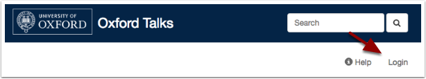
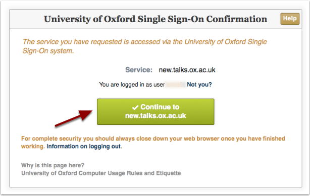
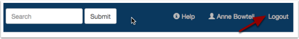

Logging in and out
==================

You can log in using your Oxford SSO username and password.

Log in
------

* The **Login** button is on the far right of the toolbar at the top of the screen
* Click **Login** and you will be taken to the usual WebAuth page to sign in
* Once you have signed in, clicking the **Continue to** button will take you back to Oxford Talks

Log out
-------

The **Logout** button is also located at the far right of the toolbar at the top of the screen.

.. Note::  Clicking this will only log you out of the Oxford Talks website. You will still be logged in to any other web pages you have logged in to with your Single Sign On username and password using the WebAuth page. If you really want to sign out of everything, then close down your browser.
