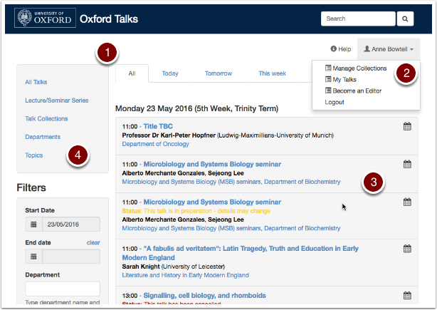
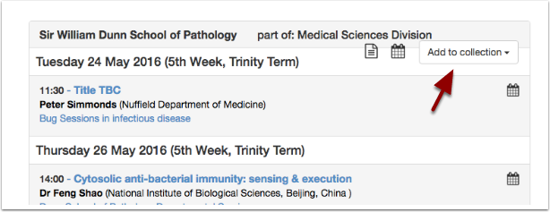
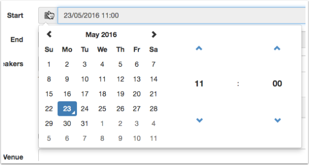
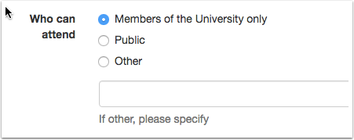
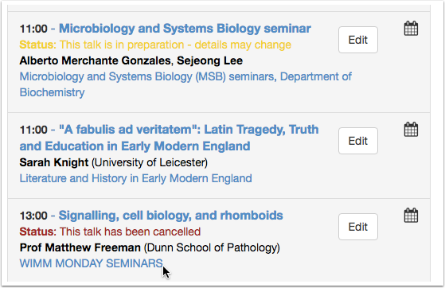

Latest Changes - May 2016
=========================

We've just released a new version of the Oxford Talks software. Here are the main changes.

Look and Feel
-------------

We've tidied up the look of the site to make it easier to find out what's coming up:

#. The home page has been redesigned - it should be quick to find what's going on this week and next by using the tabs across the top. 
#. You *might* miss the personal listing - **My Talks** - at the bottom of the old home page. This is now on the drop down list under your username.
#. The talks should be easier to scan for interesting titles or speakers. Important information about the talk should be easily noticeable as well.
#. You can now browse departments and topics.

Lists
-----

Lists have been renamed **Collections** as we thought that this better reflected the way they work. It is just a name change - everything works in the same way as before.

You can now add a department to a collection. Good news if you want to create a collection of all the series in your department and also talks of interest from elsewhere on Oxford Talks.

Date Picker
-----------

We've got a nicer date picker now for setting start and end dates. It is much easier to use.

Speakers and Audience
---------------------

#. Speakers should now appear in the order you've added them. It was going to be tricky to allow you to drag and drop speakers to get them into the right order, so if you add them in the wrong order then you'll have to remove them and add them again.
#. If you have too many speakers to list, we've allowed you to tick a box to indicate *Various Speakers*. 
#. There's now a text box you can use to specify the type of audience, if *public* or *university only* are not sufficient.

Talks in Preparation
--------------------

We've clarified talks 'in preparation'. Now a talk is automatically published when you create it, but you can switch it to 'in preparation' to let your attendees know that some details may change.

A key thing to note is that in preparation talks appear in ALL listings and are clearly flagged as 'in preparation'.

Cancelled Talks
---------------

You can now also flag a talk as cancelled. 

Developers
----------

There are one or two extras in the API now.

#. An important point - talks 'in preparation' (see above) are listed in the API output and are indicated as such with the **Status** field. 
#. The from and to parameters work properly and there is also a time delta option e.g. (from=today&to=plus7) 
#. As you can now add a department to a collection (see above), this should simplify requests.
#. We've added hosts, timezone information and .ics links to the output.