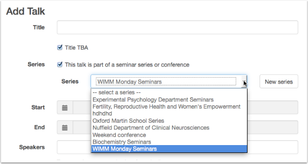

Create a series of talks
========================

A series of talks could be a Seminar Series, a Conference, a Workshop day or any other context within which talks take place.

Start entering the details of your first talk
---------------------------------------------

.. image:: images/create-a-series/start-entering-the-details-of-your-first-talk.png
   :alt: Start entering the details of your first talk
   :height: 314px
   :width: 674px
   :align: center

#. Click **Add Talk** on the toolbar.
#. Tick the series box.
#. Click the **New series** button.
#. The Add new series form will pop up.

Add the series details
----------------------

.. image:: images/create-a-series/add-the-series-details.png
   :alt: Add the series details
   :height: 446px
   :width: 663px
   :align: center

#. Choose a Series type - options at the moment are Seminar Series or Conference.
#. If you like, you can add a phrase describing the timing - the usual time the seminars take place or the dates of a conference.
#. A web address is optional - make sure you begin the address with http:// or https://.
#. Start typing the department name and then select it from the drop down list.

Save and continue
-----------------

Once you click the **Save changes** button, you can continue adding your talk.

Your series will be now be available in the drop down list for your next talk.