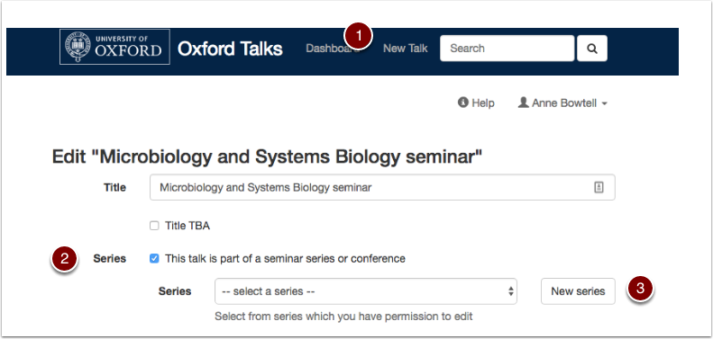
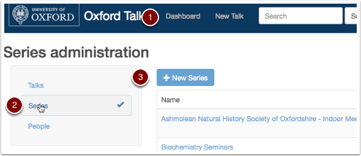
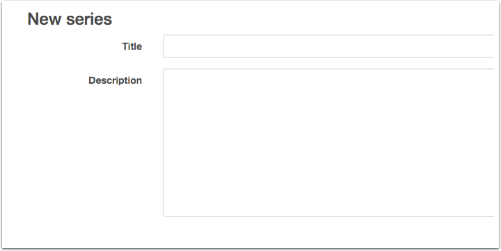
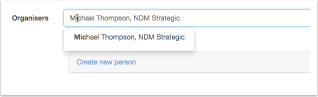
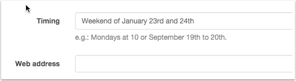

Create a series of talks
========================

A series of talks could be a seminar series, a conference, a workshop or a similar event.

via Add Talk
------------

#. Click **Add Talk** on the toolbar and start adding your talk information
#. Tick the **Series** box.
#. Click the **New series** button.
#. The **Add a new series** form will pop up.
#. Not all information about a series can be added via the pop up form - so you may need to go to the **Dashboard** to add further information later.

via the Dashboard
-----------------

Creating a series via the **Dashboard** means you can add all the information about a series in one go:

#. Click **Dashboard** at the top of the screen
#. Select **Series** from the filter on the left hand side
#. The **New series** button should appear
#. Click this to get the **New Series** form

Title and Description
---------------------

* Make sure your **Title** is not too generic - including the short name or acronymn of your department is helpful e.g.: 'WIMM Monday Seminars' rather than just 'Monday Seminars'
* The text in the **Description** can be formatted - see :doc:`Formatting Text <formatting-the-abstract>` for more information

Organisers and Organising Department
------------------------------------

Both the **Organisers** and **Organising department** fields work in the same way as for a talk, start typing to find the individual or unit you want.

Now, when you create talks and assign them to this series, you'll find that they inherit the organisers and organising department.

Timing and Web Address
----------------------

* The **Timing** field allows you to add a short piece of text describing times and dates. For instance you might want to indicate that your Monday Seminars occur *every Monday in Full Term at 11am*.
* Use the **Web address** field if your series or conference has a dedicated website or page. Remember to prefix the address with 'http://' or 'https://'.

Saving
------

When you're ready, save the series by clicking either:

* **Save and add another** to go straight to another New series form
* **Done** to preview the series you've just created

If you want to cancel your changes (before you save them) then just hit the **back** button in your browser.