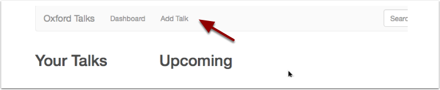

Create a talk
=============

Get started by creating a new talk.  

The Add Talk form
-----------------

You can get to the Add Talk form by clicking **Add Talk** on the toolbar at the top of the screen.

Alternatively click Dashboard and then the **New Talk** button.

The Add Talk form is quite lengthy, but the most important fields are grouped at the top:

Title
-----

.. image:: images/create-a-talk/title.png
   :alt: Title
   :height: 176px
   :width: 713px
   :align: center

Get started immediately by typing the **Title**.

If you don't yet know the title you can leave the **Title** field blank and tick the **Title TBA** box. 

For more information on scheduling talks before you have all the information see the :doc:`Prepare and publish <prepare-and-publish>` section of this guide.

Start and End
-------------

.. image:: images/create-a-talk/start-and-end.png
   :alt: Start and End
   :height: 334px
   :width: 623px
   :align: center

Clicking anywhere in the **Start** field will make the calendar picker appear.

Once you save the **Start **date and time, the **End** field will automatically be set to an hour later. You can change this by clicking in the End field.

Speakers
--------

.. image:: images/create-a-talk/speakers.png
   :alt: Speakers
   :height: 246px
   :width: 632px
   :align: center

#. If you start typing a speaker's name, you may find they are already in the system. If they aren't then, click **Create new person** to reveal the form to add a new speaker. 
#. You may add as many speakers as you like.

You will find that **Talk organisers** and **Talk hosts** can be added in the same way. Scroll down to find these fields.

Venue
-----

.. image:: images/create-a-talk/venue.png
   :alt: Venue
   :height: 169px
   :width: 647px
   :align: center

#. Start typing the name of a building or location and it should be found in the University's OxPoints system. The address and map information will be looked up automatically and displayed with the rest of the talk information.
#. Specific details - the room name or number, or information about how to gain entry - can be added in the box below.

You will find that the Organising department can be added in a similar way. Scroll down to find that field.

Saving
------

.. image:: images/create-a-talk/saving.png
   :alt: Saving
   :height: 73px
   :width: 668px
   :align: center

When you're ready, save the talk by clicking either:

* **Save and add another Talk** to go straight to a new Add Talk form
* **Done** to preview the talk you've just created

More Information
----------------

Now that you have run through the editing basics, look at the following sections for guidance on the other fields on the form:

* :doc:`Publicising your talk <publicizing-your-talk>` - explains how the **Abstract**, **Topic** and **Organising department** fields can help get your talk included in more listings
* :doc:`Formatting the abstract <formatting-the-abstract>` - provides a quick cheat sheet on how to add headings, lists and links to the **Abstract** field
* :doc:`Prepare and publish talks <prepare-and-publish>` - gives you tips and tricks on how to schedule talks before you have all the information available