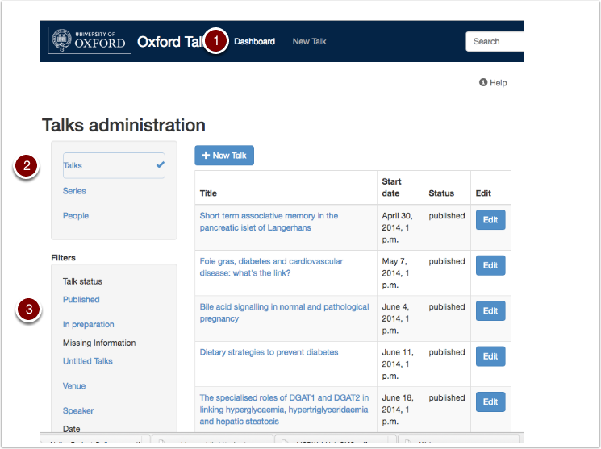
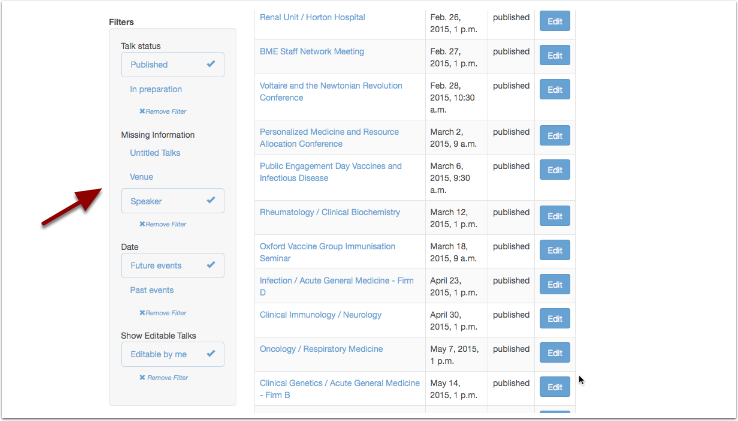
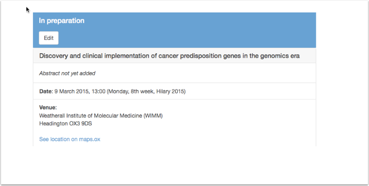

Editing and Publishing
======================

Editing
-------

#. Click **Dashboard** in the tool bar at the top of the screen to view all the talks and series you have created.
#. The column on the left allows you to switch between talks, series and people (speakers, organisers and hosts) 
#. Filters allow you to narrow the list down further

Checking for missing information
--------------------------------

.. image:: images/editing/checking-for-missing-information.png
   :alt: Checking for missing information
   :height: 338px
   :width: 605px
   :align: center

You can schedule and publish a talk even if you don't have all the details:

* You must supply the **Date** and **Time**
* Leave other fields on the form blank 
* Use the **Title TBA** check box to leave the **Title** blank

Use the **Dashboard** **Missing Information** filters to identify talks with information still to be supplied:

Here, the list of talks has been narrowed down to 

* editable by me
* still to take place
* without a speaker

Publishing
----------

Talks are flagged as **Published** when you first create them. However, you may want to indicate that a talk's details are incomplete. In this case you can switch the talk's status to **In Preparation**.

.. image:: images/editing/publishing.png
   :alt: Publishing
   :height: 374px
   :width: 741px
   :align: center

To change the status:

* On the Talk Edit form scroll down to find the **Status** field
* Switch the radio button to **In preparation**.

You can switch back to **Published** at any time.

What does 'In preparation' mean?
--------------------------------

A talk is flagged **In preparation** so that everyone is aware that the information is subject to change or incomplete.

.. Note:: **In preparation** talks are:

   * **Not Private** - all talks can be viewed and appear in all listings

   * This is a change from the previous version of the software, where **In preparation** talks did not appear in search results