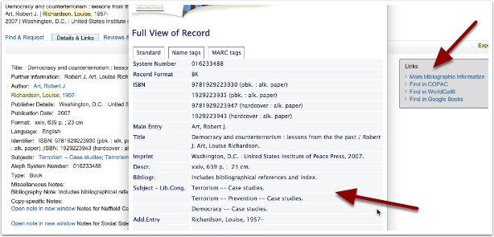
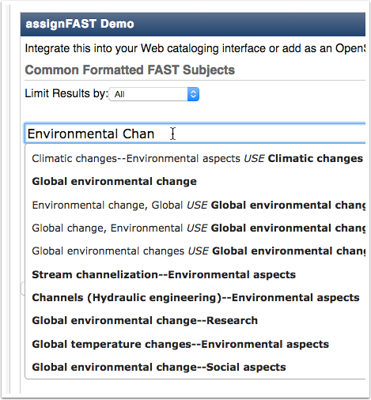
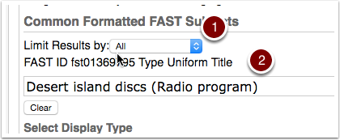

Identifying suitable topics
===========================

The topics to assign to a talk or a series are drawn from the Library of Congress Subject Headings. This is a huge database and it is sometimes hard to find the right keywords. Here are some tips, if you are not sure what topics to use, or, if you can't find the appropriate topic for your subject.

Ask a Librarian for advice
--------------------------

Your subject librarian should have a good idea of the appropriate LC Subject Headings for your particular subject area. 

Check the Libraries Catalogue for ideas
---------------------------------------

* Search `SOLO <http://solo.bodleian.ox.ac.uk/>`_ for a key publication or author.
* Select a publication record.
* Choose **More bibliographic information** from the **Links** box on the right.
* LC Subject Headings are provided under **Subject - Lib.Cong.**

.. Note:: Often the subject headings provided by the library catalogue are 'complex subjects'. These might show up when you start typing into the Topic field on the Add Talk form, but if they don't, you should be able to enter two separate topics e.g.: 'Democracy' and then 'Case Studies'

Use assignFAST for suggestions
------------------------------

This is a useful tool when you need to distinguish between homonyms, or just can't find the right subject heading

* Go to the `assignFAST <http://experimental.worldcat.org/fast/assignfast/>`_ website
* Start typing and recommendations should appear 
* Select and option and it will appear in the box ready to copy
* Copy and paste it into the Topic field in the Add Talk form and it should pop up ready to select

Limitations
-----------

Unfortunately, at the moment, Oxford Talks doesn't present us with all available Subject Headings - only those of 'Topic' / 'Topical' type.

#. You can limit the assignFAST results to show just 'Topical' Subject Headings
#. or take a note of the **Type** in the results provided

