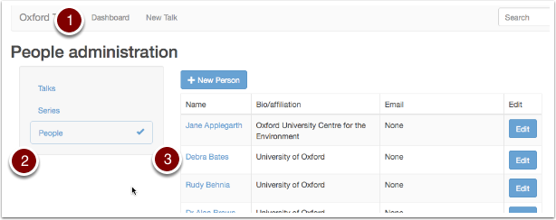
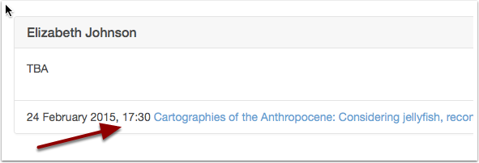
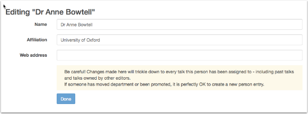

Change speaker / host / organiser details
=========================================

Speaker, host and organiser details can be changed using the Person edit form

Be careful!
-----------

.. warning::

Any Talks Editor can change the details of any person appearing in Oxford Talks as a speaker, host or organiser. When you edit their name or affiliation, the changes will **trickle down to every talk this person has been assigned to** - including past talks.  If someone has moved department or been promoted, it is perfectly OK to create a new person entry for them in their new role.

Find the person
---------------

#. Click **Dashboard** on the toolbar at the top of the screen
#. Select the **People** filter
#. Although you can go straight to the Person Edit form from here by clicking the **Edit** button, it is a good idea to click on the name of the person first and review what talks they appear in. 

Check details
-------------

Click through to review details of their talks. Any changes you make to their entry will be reflected in **all these talks**.

Person Edit form
----------------

* In addition to **Name** and **Affiliation**, you can add a **Web address** - this is a good way to provide more details about a speaker
* To cancel your changes before saving, use the **back** button on your browser

Deleting
--------

If you need to delete a person, please :doc:`contact the Oxford Talks Administration <contact>`.