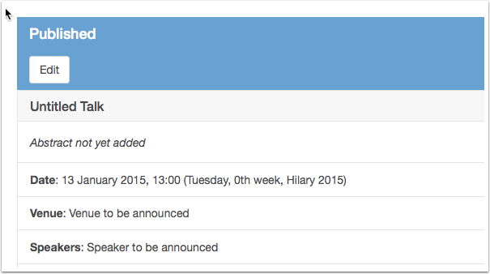
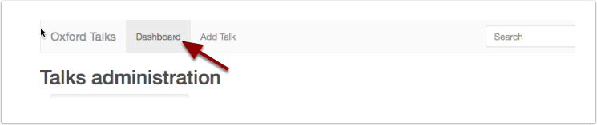
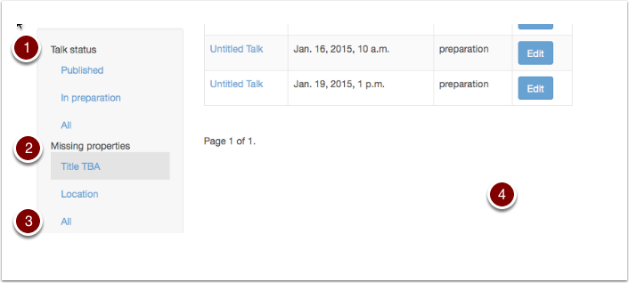

Prepare and publish talks
=========================

When you begin creating a talk it will be flagged as **In preparation**, you can switch the flag to **Published** when you are ready.

Switching a talk to Published 
------------------------------

On the Talk Edit form scroll down to find the **Status** field and switch the radio button to **Published**.

You can switch back to **In preparation** at any time.

Scheduling talks before you have all the details
------------------------------------------------

You can schedule and publish a talk even if you don't have all the details:

* You must supply the **Date** and **Time**
* Leave other fields on the form blank 
* Use the **Title TBA** check box to leave the **Title** blank

Review incomplete talks
-----------------------

Click **Dashboard** in the tool bar at the top of the screen to view all your talks.

#. Use the **Talk status** filter to show In preparation talks or...
#. Use the **Missing properties** filters to get the dashboard to show incomplete talks only - the filter will be highlighted when it is active.
#. To remove a filter click **All**

What does 'In preparation' mean?
--------------------------------

.. image:: images/prepare-and-publish/what-does--in-preparation--mean-.png
   :alt: What does &apos;In preparation&apos; mean?
   :height: 374px
   :width: 741px
   :align: center

A talk in preparation is:

* **Not Private** - all talks can be viewed if you know the web address
* **Can't be found** through the search interface or the lists on the Oxford Talks website
* Listed on your Dashboard
* Clearly marked as **In preparation**