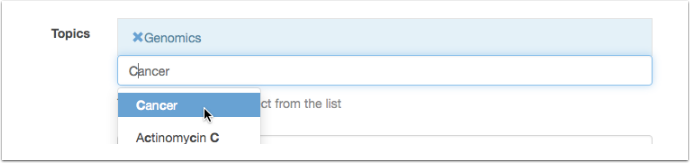
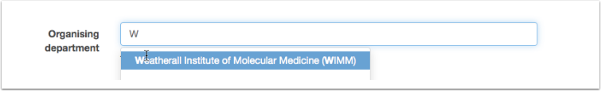

Publicising your talk
=====================

Oxford Talks will automatically compile listings of talks in subject areas and can pull together all talks belonging to a department or a division. The more information you can give about a talk, the wider it will be publicised.

Adding your talk to topic listings
----------------------------------

We use Topics to group talks into subject areas. Assigning one or more topics to your talk will mean that it will have a better chance of being discovered and readvertised by specialist communities.

Go to the **Topics** field on the Add talk form. Start typing and you will be offered options from the `Library of Congress Subject Headings <http://id.loc.gov/authorities/subjects.html>`_. Once you've found and selected a topic it will be highlighted in blue. To remove it, just click on the 'X'.

Please start with broader topics first e.g.: 'Neuroscience' or 'Ancient History', and then add narrower topics in the specialist area of the talk e.g.: 'Molecular Neurobiology' or 'Naval Warfare'.

Viewing topic listings
----------------------

To see a listing of talks for a specific topic, type the topic name into the site search box and then use the **Topic** filters on the left hand side of the results page. Alternatively, click on the topic name when viewing a talk.

The talks site will create a listing for any topic if you provide the FAST Topic URI e.g.:

`https://new.talks.ox.ac.uk/talks/topics/id/?uri=http://id.worldcat.org/fast/1120819 <https://new.talks.ox.ac.uk/talks/topics/id/?uri=http://id.worldcat.org/fast/1120819>`_ 

You can search for the FAST Topic URI here:

`https://new.talks.ox.ac.uk/topics/search?q=sleep <https://new.talks.ox.ac.uk/topics/search?q=sleep>`_ 

look for a phrase like this in the results:

::

     "uri":"http://id.worldcat.org/fast/1120819"

Adding your talk to department listings
---------------------------------------

We use the University's complete list of units, buildings and locations, Oxpoints, to specify the department or unit a talk belongs to. 

Start typing the name in the **Organising department** field in either the Series or the Talk editing form. 

Once you've assigned a department or unit to a Series it will be automatically assigned to any Talks you then add to the Series. 

If you choose a sub-department or unit, then the talk will also appear in the parent department and division listings.

Adding an abstract
------------------

Keywords in the talk abstract will be used for searching, so please add the abstract if you have it. 

Public Collections
------------------

.. Note:: |changes|

As well as topic and department listings, there may be some more *ad hoc* listings you would like your talk to be included in.  You can set up a Public Collection to collect together talks relevant to a particular theme, enterprise or project within the University - Athena Swan is a good example. 

* Follow the instructions in the User Guide - :doc:`Collect talks you are interested in <../talk-users/make-a-list>` - to create and publish a list
* You can also allow other Talks Editors to add talks to your list - see the :doc:`Sharing Editing <share-editing>` section for more details