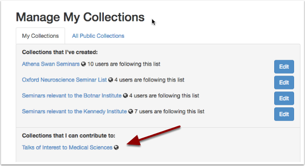

Sharing editing
===============

You can share the editing of a series or an individual talk or a collection with another Talks Editor

Series of Talks
---------------

.. image:: images/share-editing/series-of-talks.png
   :alt: Series of Talks
   :height: 151px
   :width: 560px
   :align: center

Type in the email address of another Talks Editor in the **Other Editors** field. You will need to know the full address as this field doesn't autocomplete, however once you've finished typing the address will then appear in a drop-down list for you to choose.

You may add as many editors as you like. The **Edit** button for the Series will then appear in the other editors' Dashboards 

.. Note:: The address will only pop-up in the Talks Editor has already been signed up to Oxford Talks. If their email doesn't appear, make sure they have been signed up. For more information see :doc:`Apply to be a Talks Editor <sign-up>`.

Individual Talks
----------------

If you share editing of a Series with a Talks Editor, then they will have the rights to edit all the Talks in that series too. 

You can adjust this in the **Other Editors** field of the individual talk.

Collections
-----------

Once you have signed an editor up to your collection they will see it on their **Manage Collections** page and will find the collection available in the dropdown box on each talk, series and department or unit page.

