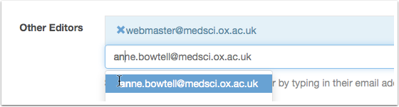

Sharing editing
===============

You can share the editing of a series or an individual talk with another Talk Editor

Series of Talks
---------------

Start typing the email address of another Talks Editor in the **Other Editors** field.

You may add as many editors as you like. The **Edit** button for the Series will then appear in the other editors' Dashboards 

.. note::

Note: the field will automatically complete only if the Talks Editor has already been signed up to Oxford Talks. If their email doesn't appear, make sure they have been signed up. For more information see :doc:`Apply to be a Talks Editor <sign-up>`.

Individual Talks
----------------

If you share editing of a Series with a Talks Editor, then they will have the rights to edit all the Talks in that series too. 

You can adjust this in the **Other Editors** field of the individual talk.