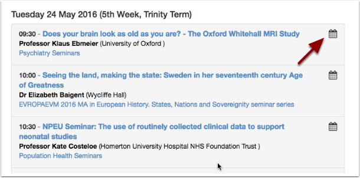
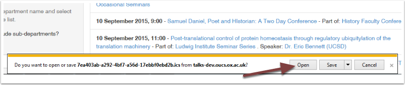
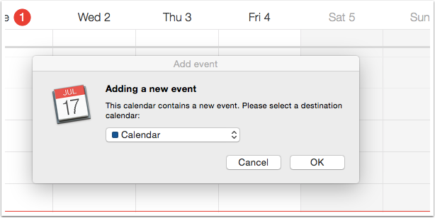
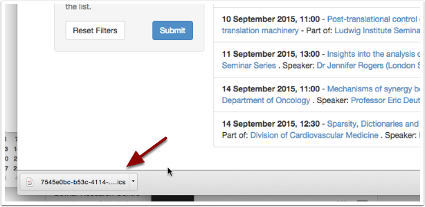
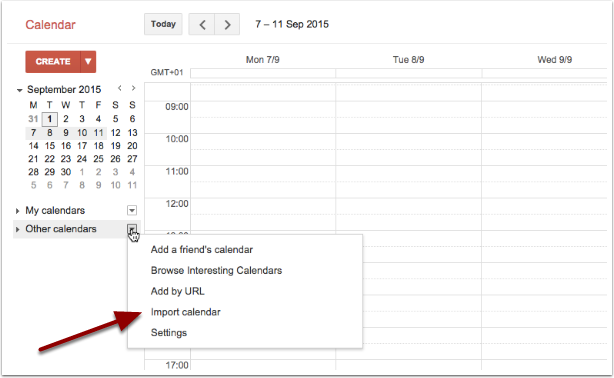
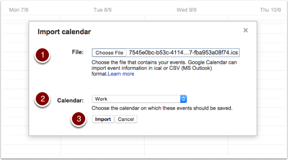

Copy talks to your own calendar
===============================

You can put the details of any talk into your Nexus, Google or iCloud calendar. How this works depends on the browser and calendar you are using; we've covered some of the standard combinations here. The following steps will work for either a single talk or a series of talks.

.. Note:: Using this method, if the talk information changes in any way, the information in your own calendar **won't update automatically**. You should always check Oxford Talks to make sure that the time or location hasn't changed since you added the talk to your calendar.

Find the Add to Calendar link
-----------------------------

* For a single talk, click on the **calendar icon** next to any talk

.. image:: images/add-to-your-calendar/306f6c30-18aa-46b9-b32c-a4a1703b6d55.png
   :alt: 
   :height: 195px
   :width: 614px
   :align: center

* For a series of talks, use the **Add to your calendar** button

The next steps depend on which combination of browser and calendar you are using:

Using Internet Explorer and Outlook (PC)
----------------------------------------

* Clicking the calendar icon in Internet Explorer will open a window at the bottom of your browser
* Click **Open**

.. image:: images/add-to-your-calendar/a76b304c-99bd-41f3-a3a6-8e8196a54840.png
   :alt: 
   :height: 379px
   :width: 600px
   :align: center

* The talk details open as an Outlook calendar item
* Click **Save & Close** to add the talk to your calendar

Using Safari and Calendar (Mac)
-------------------------------

* Clicking the calendar icon in Safari should open the Calendar app automatically
* You will be asked where you want to save your event - this can be your main Nexus calendar if you want
* If you choose to add the talk to your Nexus calendar, you may get this message

.. image:: images/add-to-your-calendar/dbfadfa7-5d03-4c94-b499-59a1d773259c.png
   :alt: 
   :height: 290px
   :width: 567px
   :align: center

* Click OK and don't worry, this just refers to the link back to the original talk. It will be copied over to the event notes and will be clearly visible
* Your talk(s) will be added to your chosen calendar

Using Chrome and Google Calendar
--------------------------------

* Clicking on the calendar icon in Chrome will download a file to your computer - you can usually see this at the bottom of your browser.
* The filename will be a list of numbers, letters and dashes ending in '.ics' e.g: 7545e0bc-b53c-4114-b3b7-fba953a08f74.ics

* In Google Calendar, choose **Import calendar** from the options for **Other calendars**

#. Browse for the file you've just downloaded
#. Choose the calendar you want to import the file into
#. Click import to add your talk(s) to your chosen calendar

Further Information
-------------------

Subscribe to a continuously updated feed of events

Set up reminders in your calendar