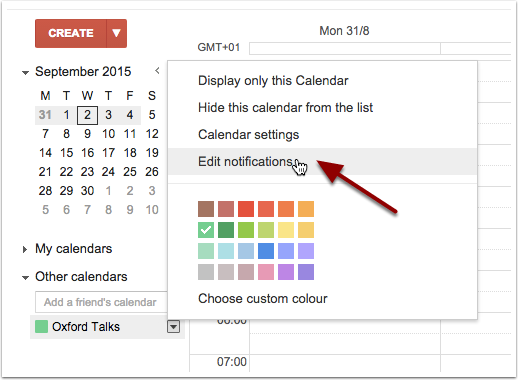
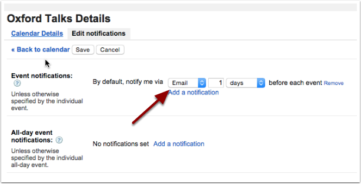
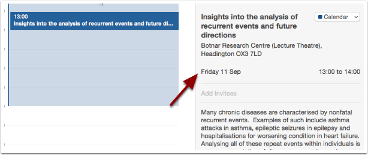
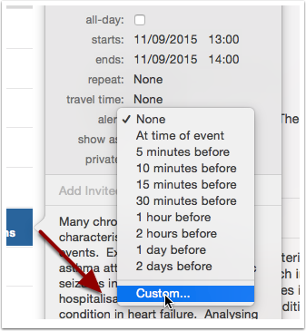
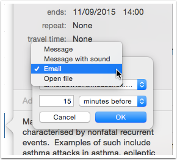

Set up email reminders
======================

Reminders and notifications by email are not yet available. Meanwhile, there are a few limited options to set up email reminders using your own calendar.

Google Calendar
---------------

You can set up a default email reminder for any calendar feed. This will apply to all the talks in the feed. (see the :doc:`Get an up-to-date feed <feed-in-your-calendar>` section for more information on calendar feeds) 

* Click on the drop down list next to the calendar created by the feed
* Choose **Edit notifications**

* Adjust the **Event notifications** to notify you by Email 

Calendar (Mac)
--------------

You can set up an email reminder for individual events *copied* into your **Nexus** calendar, but not for calendar feeds. (see the :doc:`Copy talks <add-to-your-calendar>` section for for information about copying talks)

* Click on the date in an event display

* This will open up a panel to edit the date and other options
* Choose *Custom* from the **alert** options list

* Then choose *Email* in the pop-up box and set your email address and when you want to be reminded

