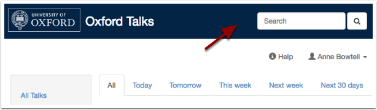
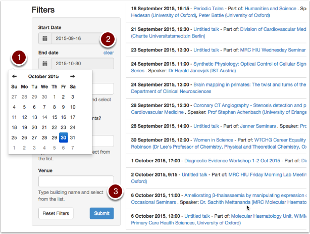
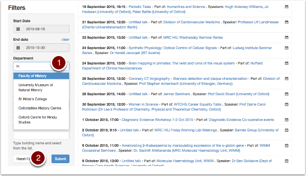
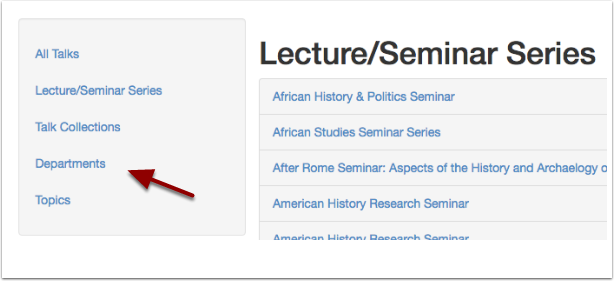
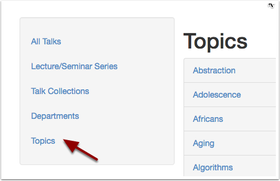
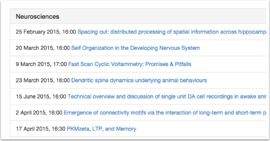

.. Note:: |upcoming| 

Explore Oxford Talks
====================

An introduction to Oxford Talks

Browse and Search
-----------------

Today's talks are always displayed on the Home Page of Oxford Talks. To find out more about upcoming talks use the **Browse Talks** button or the **Search** box

View upcoming talks
-------------------

The Browse Talks page will show you all talks for the next 8 weeks. Use the date filters on the filter panel to adjust this.

#. Click the calendar icon on the **Start Date** or **End Date** filters to set the date
#. If you want to see all the upcoming talks, use the **clear** button on the **End Date** filter
#. Click **Submit** at the bottom of the filter panel

See my department's talks
-------------------------

To see all upcoming talks happening in your department

#. Start typing into the **Department** box on the filter panel. You don't need to type the full name (for instance, 'HI' will find the Faculty of History, acronyms like 'DPAG' will also work)
#. Remember to click **Submit**

Find a seminar series
---------------------

If you are interested in a particular seminar series, or meetings of a society:

* Use the **Series** box in the filter panel if you know the name of the series you are interested in
* Alternatively, browse the full list of series from the **View all** panel

Discover talks on an interesting topic
--------------------------------------

It's also possible to find talks on a on a particular topic - you don't need to know the series talk belongs to or the organising department - there are two ways to do this:

**Public Lists**

* Click **Public Lists** in the **View all** panel to see collections of talks made by other people

**Topics**

Talks Editors are also beginning to tag talks with a huge range of topics (based on the Library of Congress subject headings). Ways to browse talks by topic will be delivered in the next phases of development.

Meanwhile:

* To find talks in a particular subject area use the **Search** box to type your search term

* All the topics assigned to a talk or series are clickable, so you can explore a topic further from an individual talk

.. image:: images/explore-talks/204ed603-33b8-48b4-9ff3-c84675a70818.png
   :alt:
   :height: 501px
   :width: 487px
   :align: center

Further Information
-------------------

There are further guides on:

* :doc:`Making your own collected list of talks <make-a-list>`
* :doc:`Copying talks to your calendar <add-to-your-calendar>`
* :doc:`Getting a feed of talks into your calendar <feed-in-your-calendar>`
