Get an up-to-date feed in your own calendar
===========================================

You can subscribe to a series or list of talks in your own calendar software. Subscribing means that the information is updated on a regular basis, so that you always have the latest information about the times and locations of talks.

.. Note:: At present, it isn't possible to get the web version of Nexus calendar to subscribe to calendar feeds.

Get the feed URL
----------------

* Find the series you would like to subscribe to
* Right click on the **add to your calendar** button to copy the feed to URL to your clipboard (the **Copy Shortcut** or **Copy Link Address** option) 

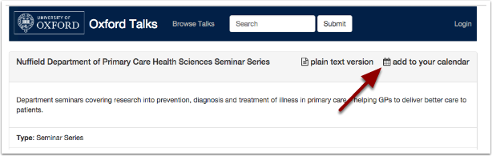

.. Note:: When you come to paste the URL it should look something like this: `https://talks.ox.ac.uk/api/series/c70914d8-42c1-4ec9-a825-d7041570bdf9.ics <https://talks.ox.ac.uk/api/series/c70914d8-42c1-4ec9-a825-d7041570bdf9.ics>`_ . The alphanumeric string is the unique identifier for the series, so this bit will be unique for each feed.

Outlook
-------

* After copying the URL, click **Open Calendar** and select **From Internet**

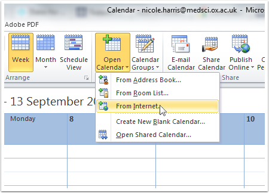

* Paste the URL into the **New Internet Calendar Subscription** box 
* Click **OK**

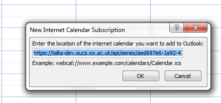

* The calendar takes the last part of the web address as its name (for example: aed697e6-1a92-473d-a686-f77487689e0b.ics) 
* To change the name click **Advanced ...**

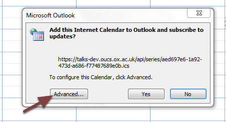

#. Type a new name for the calendar in the **Folder Name** box
#. Click **OK**

.. image:: images/feed-in-your-calendar/2ff94965-ef90-4a28-9727-4fc7c5c024d1.png
   :alt: 
   :height: 387px
   :width: 600px
   :align: center

* Click **Yes**
* The calendar will open as a new calendar in Outlook

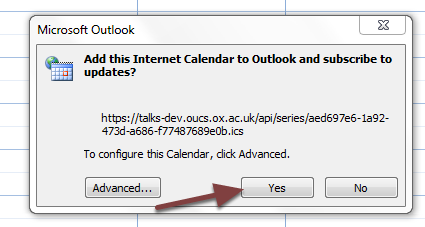

.. Note:: You won't see this subscribed calendar on your web-based Nexus calendar

Calendar (Mac)
--------------

* Copying the feed URL (see the first step in this tutorial)
* Click **File** in the top menu and then click **New Calendar Subscription**

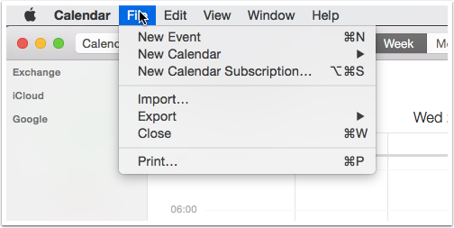

* Paste the feed URL into the box
* Click **Subscribe**

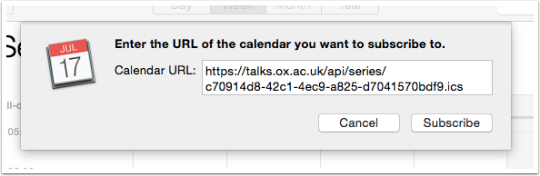

You will be asked to confirm the settings:

#. Give the calendar a meaningful **Name**
#. Choose *On My Mac* for the **Location** of the calendar
#. Set **Auto-refresh** to *Every day* (this should be enough to ensure the information is up-to-date, but be sure to check Oxford Talks as well)

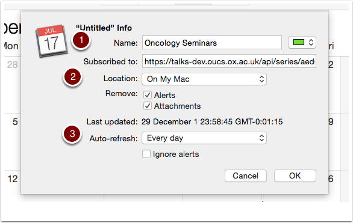

* The feed will now appear as a new calendar in your list under **Other**
* The little wireless symbol reminds you that it is a subscription to a calendar feed

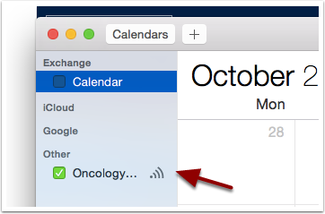

Google Calendar
---------------

* Copy the feed URL (see the first step in this tutorial)
* Click the **Other calendars** drop down list
* Select **Add by URL**

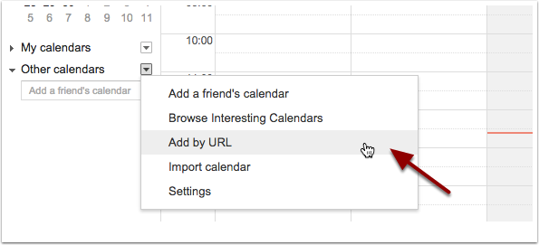

* Paste the feed URL into the **URL** box 
* Click **Add Calendar**

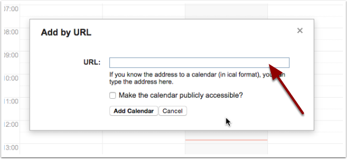

#. You will then find an additional calendar under **Other calendars** - events will appear on the calendar grid with a shaded background to indicate that they come from a feed
#. Click the calendar's drop-down list and select **Calendar settings** to change the name of the calendar to something more readable

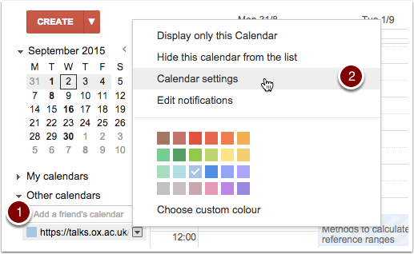

Further Information
-------------------

If you are using Google Calendar, look at the :doc:`Get email reminders <email-reminders>` section to see how to set these up.