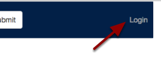
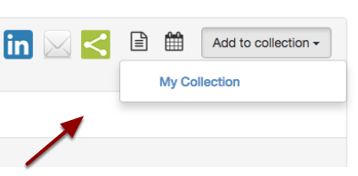
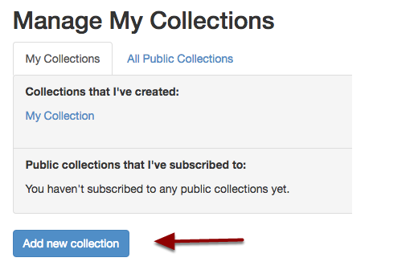
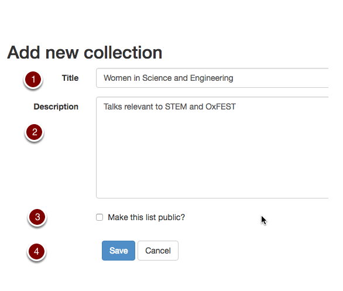
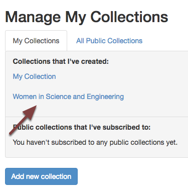
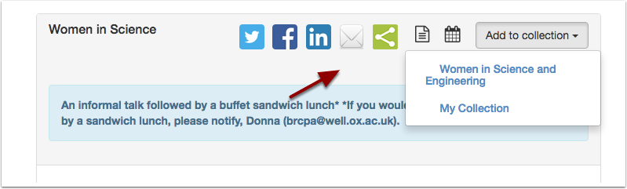
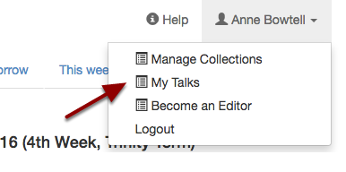
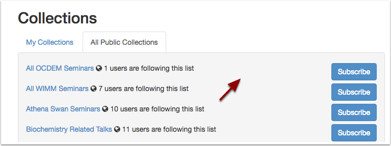

.. Note:: |changes| 

Collect talks you are interested in
===================================

You can log in and create personal collections of any of the talks on Oxford Talks. These collections can remain private to you or you can make them public for anyone to view and follow. 

You can also decide to follow a collection of talks that another user has made public.

Login
-----

* Click the **Login** link at the top right of the screen
* You will be prompted for your Oxford Single Sign On username and password

(for more help see the :doc:`Logging in and Out <../general/log-in>` section of this guide)

.. Note :: Collections used to be known as Lists, if you have been using Oxford Talks for a while, don't worry, nothing much has changed - just the name. However, if you want to see your collected talks, use **My Talks** in the drop down list underneath your name.

Add talks to My Collection
--------------------------

* Browse for talks from the home page or **Search** for talks you would like to add

* Open the talk page.
* Click the **Add to Collection** button and select *My Collection*
* You will also see the **Add to Collection** button on Series and Department and Unit listing pages

Create a new collection
-----------------------

.. image:: images/make-a-list/create-a-new-collection.png
   :alt: Create a new collection
   :height: 192px
   :width: 386px
   :align: center

You can make as many collections as you like (for example you could collect talks relevant to Women in Science, Engineering and Technology and then make this collection public if you think it would be helpful to others).

* Click **Manage Collections** in the drop-down list below your name

* Click the **Add new collection** button.

#. Give your collection a **Title**. If you are going to make the collection publically available make sure that this title will be meaningful to others.
#. Enter a **Description**
#. Tick the box if you want to make the collection public
#. Click **Save**

* The collection has been created and is available on your **Manage collections** page. 
* You will also see it when you click the **Add to Collection** button on each talk, series and department/unit page.

See all the talks you've collected
----------------------------------

You'll find **Your Talks** - an aggregated listing of all the talks you have added to your own personal and public collections - by clicking on the dropdown list below your name. 

Add someone else's public collection to Your Talks
--------------------------------------------------

* Click the **Manage Collections** button (available to logged in users only)
* Alternatively choose **Public Collections** in the left-hand panel of the home page
* If you are logged in, click the **Subscribe** button next to the list and the talks in this list will be added to **Your Talks** 

Further Information
-------------------

* All collections have an **Add to my Calendar** button so that you can add them to your own calendar. See the :doc:`Get an up-to-date feed in your own calendar <feed-in-your-calendar>` section for details. 
* If you want to share the process of collecting talks with other people, you will need to become a Talks Editor. See the :doc:`Talks Editor Guide <../talk-editors/sign-up>` for more information.