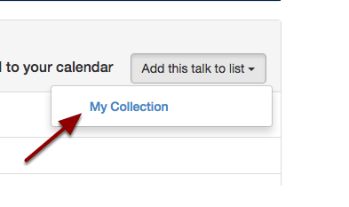
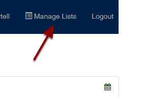
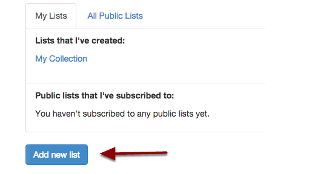
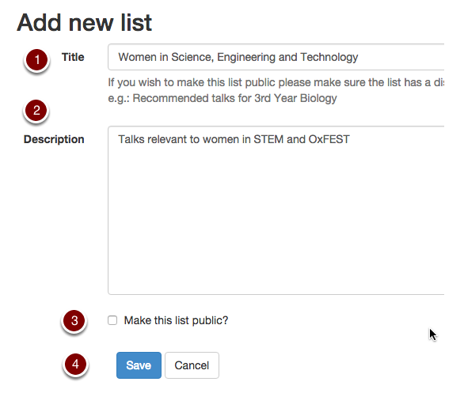
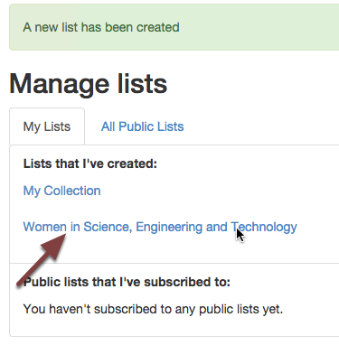
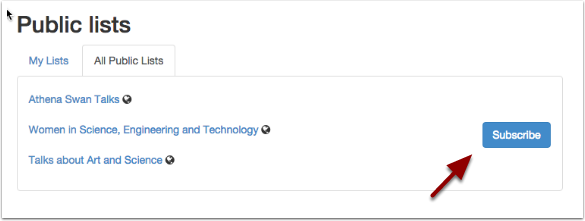

Collect talks you are interested in
===================================

You can log in and create personal lists of any of the talks on Oxford Talks. These lists can remain private to you or you can make them public for anyone to view and follow. 

You can also decide to follow a list of talks that another user has made public.

Login
-----

.. image:: images/make-a-list/login.png
   :alt: Login
   :height: 102px
   :width: 269px
   :align: center

* Click the **Login** link at the top right of the screen
* You will be prompted for your Oxford Single Sign On username and password

Add talks to My Collection
--------------------------

.. image:: images/make-a-list/add-talks-to-my-collection.png
   :alt: Add talks to My Collection
   :height: 193px
   :width: 492px
   :align: center

* **Browse Talks** or **Search** for talks you would like to add

* Open the talk page.
* Click the **Add this talk to list** button and select *My Collection*

Create a new list
-----------------

You can make as many lists as you like (for example you could collect talks relevant to Women in Science, Engineering and Technology and then make this list public if you think it would be helpful to others).

* Click **Manage Lists** in the navigation bar on the top right of your screen

* Click the **Add new list** button.

#. Give your list a **Title**. If you are going to make the list publically available make sure that this title will be meaningful to others.
#. Enter a **Description**
#. Tick the box if you want to make the list public
#. Click **Save**

* The list has been created and is available on your **Manage lists** page. 
* You will also see it when you click the **Add this talk to list** button on each talk or series page.

.. image:: images/make-a-list/9f3e7c18-b097-4477-a1f1-b0d899512d0b.png
   :alt: 
   :height: 157px
   :width: 625px
   :align: center

See all the talks you've collected
----------------------------------

Go back to the **Talks Home Page** and you will now find **Your Talks** - an aggregated listing of all the talks you have added to your own personal and public lists 

.. image:: images/make-a-list/see-all-the-talks-you-ve-collected.png
   :alt: See all the talks you&apos;ve collected
   :height: 378px
   :width: 554px
   :align: center

Add someone else's public list to Your Talks
--------------------------------------------

* Click the **Manage Lists** button (available to logged in users only)
* Alternatively click **Browse Talks** at the top of the screen, and choose **Public Lists** in the left-hand panel
* If you are logged in, click the **Subscribe** button next to the list and the talks in this list will be added to **Your Talks** on the **Home Page**

Further Information
-------------------

* All lists have an **Add to my Calendar** button so that you can add them to your own calendar. See the :doc:`Get an up-to-date feed in your own calendar <feed-in-your-calendar>` section for details. 
* If you want to share the process of collecting talks to a list with other people, you will need to become a Talks Editor. See the Talks Editor Guide for more information.